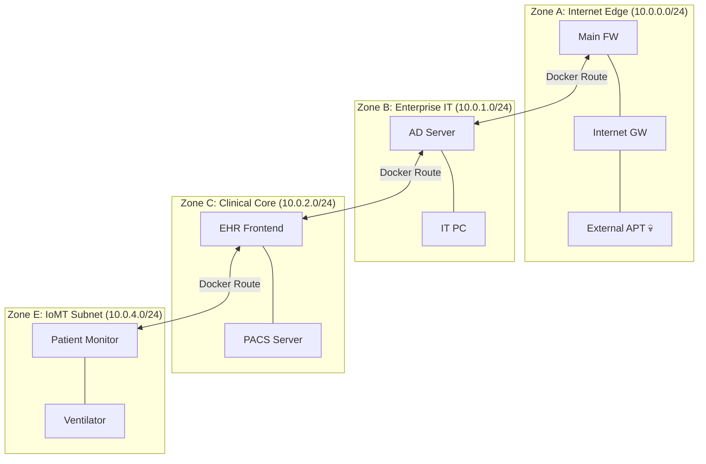

# 🏥 IoMT Medical NIDS Simulator

**A Production-Grade, Time-Series Network Intrusion Detection Dataset Generator for Healthcare IoT (IoMT) Environments.**

## 📌 Overview
The **IoMT Medical NIDS Simulator** is an advanced event-driven behavioral simulation engine explicitly designed for Academic Research and Machine Learning (ML) model training. It overcomes the limitations of older static datasets (like NSL-KDD or CICIDS2017) by dynamically generating **highly realistic, flow-level network traffic** spanning multiple days of "hospital business hours," incorporating complex multi-stage Cyber Kill Chains (MITRE ATT&CK).

Every generated dataset outputs raw Flow Metadata (`Source IP, Dest IP, Port, Protocol, Packets, Bytes, Duration, TCP Flags`) without mathematical aggregation, perfectly mirroring real-world NetFlow or Zeek firewall outputs.

## 🚀 Key Features
- **Deterministic Chronological Splitting:** Automatically generates strict `train.csv` (80%) and `test.csv` (20%) datasets without random shuffling to preserve temporal dependencies and zero-day realism for ML models.
- **24 Built-In Attack Scenarios:** Simulates APTs, Ransomware, Botnets, and Insider Threats targeting critical infrastructure (CT Scanners, MRI, Patient Monitors, PACS).
- **Interactive Web Dashboard:** A beautiful Glassmorphism GUI to control simulations, run the dataset generator, and construct attacks.
- **Dynamic Scenario Builder:** A graphical Form-Based UI allowing users to visually construct new multi-stage cyber-attacks (Recon → Exploit → Exfil) and instantly register them into the engine.
- **Topological Physics Graph:** An interactive `vis.js` visualization of the 38 hospital assets segmented across 6 strict security zones (Internet, Enterprise IT, Clinical Core, Imaging, IoMT Subnet, Vendor Area).

## 🛠️ Architecture & Technologies
- **Backend:** Pure Python 3 (Zero heavy dependencies) using multithreaded simulation queuing.
- **Frontend Dashboard:** HTML5, CSS3, Vanilla ES6 JavaScript (No React/NPM required).
- **Visualization:** HTML5 Canvas, Server-Sent Events (SSE) for Live Streaming, `vis.js` for Interactive Topology.

## 🌍 Two Worlds of Simulation
This framework offers two distinct modes depending on your research needs: The Mathematical Engine (for ultra-fast Big Data generation) and Docker Orchestration (for physical Layer-2 experimentation).

### World 1: The Mathematical Engine (Big Data ML Generation)
*Generates millions of deterministic time-series flows in seconds.*


### World 2: Docker Orchestration (Physical Layer Emulation)
*Spins up the topology as 38 real Alpine Linux containers on isolated Docker bridge networks.*


## 💻 Plug & Play Execution

### 1. Generate the Raw ML Dataset (Mathematical Mode)
Bypass the GUI and instantly compile a `train.csv` (80%) and `test.csv` (20%) tracking all 24 attack types over 7-days:
```bash
python main.py --generate-dataset --output ./output_datasets/
```

### 2. Start the Interactive Web Dashboard
Explore the Live Engine, view the Topology, or build Custom Scenarios visually:
```bash
python main.py --web --port 8080
```
*Then open `http://localhost:8080` in your browser.*

### 3. Build & Run the Physical Docker Subnets (Docker Mode)
Create a real physical testing environment using Linux containers:
```bash
python scripts/docker_orchestrator.py --topology configs/devices/medium_hospital.json
docker-compose -f docker-compose-hospital.yml up -d
```

### 4. Synthesize Deep Packet PCAPs
Convert the generated Flow CSV back into real `.pcap` files for deep payload inspection:
```bash
pip install scapy
python scripts/pcap_exporter.py --input output_datasets/train.csv --output my_dataset.pcap
```

### 4. Docker Orchestration (Physical Layer Emulation)
To overcome the physical abstraction limit of standard simulators, we provide a dynamic Docker Orchestrator. This script reads your JSON Topology and synthesizes a full `docker-compose.yml` where every single hospital asset is an isolated Alpine Linux container, and every Zone is a strictly isolated Docker Bridge Network with routing enabled across the Firewall gateways.
```bash
python docker_orchestrator.py --topology output/examples/devices/medium_hospital.json
docker-compose -f docker-compose-hospital.yml up -d
```

### 5. PCAP Synthesis (Deep Packet Inspection)
While the core engine generates ultra-fast Flow-level ML datasets (CSV/Parquet), if your research requires Deep Packet Inspection (DPI) on raw binary payloads, you can convert the flow output directly into `.pcap` format.
```bash
pip install scapy
python pcap_exporter.py --input test_dataset/train.csv --output my_malware_dataset.pcap
```

## 🧠 Why Build This?
Current Binarizers (like **FuzzTM**, **CHISEL**, and **CSTB**) and novel Tsetlin Machine frameworks require immense, temporally accurate data to train effectively for low-power Microcontroller (MCU) deployment. 

Generators that just blast random TCP packets do not teach ML models how to track multi-stage behaviors or recognize what an infusion pump's "normal heartbeat" looks like. This simulator solves that problem by enforcing strict behavioral baselines per device role, allowing researchers to evaluate their algorithms against production-grade telemetry.

## Architecture & Topology 

IoMT Simulator operates a **"Two Worlds"** paradigm to bridge the gap between Big Data mathematics for ML generation, and physical OS emulation for real-world academic research. 

*   **World 1 (Mathematical Flow Engine)**: Capable of tracking 10,000+ assets with microsecond temporal accuracy directly into `.csv` formats, leveraging the Tsetlin Machine and FuzzTM mathematical paradigms.
*   **World 2 (Docker Orchestration)**: A complete physical Layer-2 translation. It converts the abstract configuration into an identical containerized testbed array (matching the presentation formats seen in prominent references like the **UNB CIC IoT Dataset 2023**), wiring 38 separate Alpine Linux containers to explicitly segregated Docker Bridge Subnet routing tables.

### Topology Diagram Visualizations
Both modes feature their own fully interactive HTML Visualizers (`docs/visualizations/`) offering perfect, academic-grade structural mapping of the routing paths.
## 📚 Academic References & Reading
The "Two Worlds" architecture of this simulator is firmly based on modern cybersecurity research methodologies. If you are researching Machine Learning for IoT Security, consider these foundational papers establishing the validity of both approaches:

**Foundations of World 1 (Mathematical Flow Generation):**
1. **Ring et al. (2019)** - *A Survey of Network-based Intrusion Detection Data Sets* (Comput. Secur.) - Validates the supremacy of synthesized Flow-metadata datasets over raw PCAP for modern ML scale training.
2. **Shiravi et al. (2012)** - *Toward developing a systematic approach to generate benchmark datasets for intrusion detection* - Establishes the probabilistic, state-machine "Profile" generation methodology used in our engine, exposing the flaws of legacy datasets like NSL-KDD.

**Foundations of World 2 (Docker Orchestration):**
3. **Vidal et al. (2020)** - *Building an IoT-Aware Cyber Range with Docker* - Validates the use of isolated Docker Bridge networks and lightweight containers for deterministic Cyber-Physical System emulation.
4. **Alotaibi & Hussein (2022)** - *A Docker-based Architecture for Emulating Cyber-Physical Systems* - Demonstrates how physical SDN and Docker routing are the gold standard for testing multi-stage kill chains.

**Application to Novel AI (Binarizers):**
5. **Hinduja et al. (2023)** & **Abhijit et al. (2020)** - *Fuzzy Tsetlin Machines* - Explains why these highly scalable models require temporally accurate datasets with valid, sequential metadata to function on low-power IoT devices.

## 📝 License
MIT License. Free for academic and research use.
